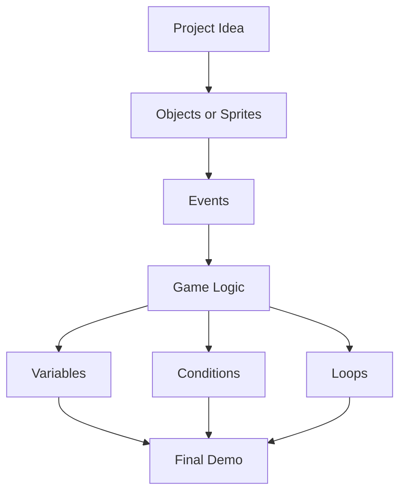
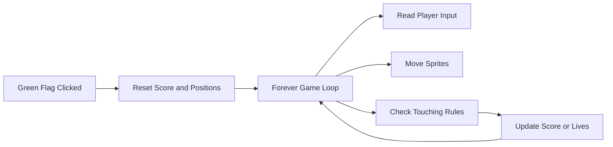
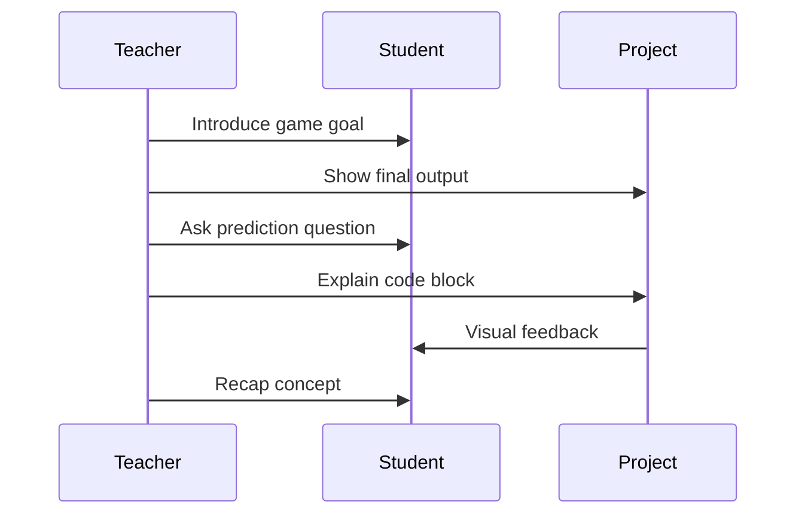

# Architecture Overview

## Learning Architecture

```mermaid
flowchart TD
    A[Project Idea] --> B[Objects or Sprites]
    B --> C[Events]
    C --> D[Game Logic]
    D --> E[Variables]
    D --> F[Conditions]
    D --> G[Loops]
    E --> H[Final Demo]
    F --> H
    G --> H
```

## Scratch Game Runtime

```mermaid
flowchart LR
    Start[Green Flag Clicked] --> Setup[Reset Score and Positions]
    Setup --> Loop[Forever Game Loop]
    Loop --> Input[Read Player Input]
    Loop --> Movement[Move Sprites]
    Loop --> Collision[Check Touching Rules]
    Collision --> Score[Update Score or Lives]
    Score --> Loop
```

## Demo Strategy

```mermaid
sequenceDiagram
    participant Teacher
    participant Student
    participant Project
    Teacher->>Student: Introduce game goal
    Teacher->>Project: Show final output
    Teacher->>Student: Ask prediction question
    Teacher->>Project: Explain code block
    Project->>Student: Visual feedback
    Teacher->>Student: Recap concept
```

